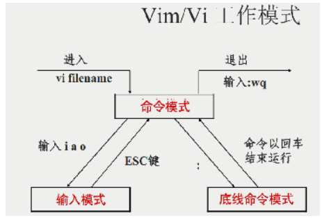
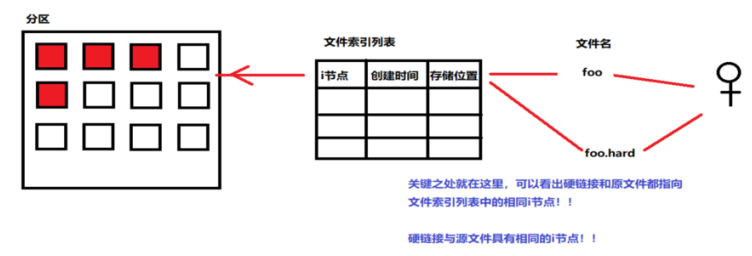
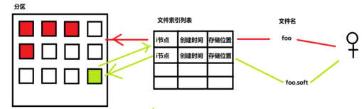

# Linux常用命令 

## 目录操作命令

### cd	目录切换命令

cd 目录名	 切换到指定目录；

cd ..	向上一层；

cd /	退到根目录；

cd -	切换到上一个操作的目录；

cd ~	切换到当前用户的home目录；

### ls	查看目录下所有内容

ls -a	查看所有文件，包含隐藏文件；

ls -l	查看所有文件的详细信息，可简写为ll；

ls -h	要想发挥该命令效果，应该与 ls -l共同使用：ls -lh，该命令会将ls -l 显示的文件大小带上单位，不止会有kb，如果文件较大，会以M或者更大的单位显示；

ls -i	显示文件节点；

ls -d	(ls -ld)显示当前目录的信息；

### mkdir	创建目录

mkdir 目录名	创建单级目录;

mkdir 目录名1 目录名1/目录名2	创建 目录名1/目录名2多级目录；

mkdir -p 目录名1/目录名2	创建多级目录；

### rm，rmdir	删除文件，目录

rm 文件名	如果写目录要保证被删除的目录必须是空目录，如果只有隐藏文件无法删除；

rm -r 目录名/文件名	如果是目录就递归删除该目录下所有文件，最后删除该目录；

rmdir 目录名，删除目录（无法删除文件），保证被删除的目录必须是空目录，如果只有隐藏目录可以删除；

rmdir 目录1/目录2 目录1 删除目录1即其子目录，但是要保证目录1下仅有子文件夹，没有文件；

## 文件操作

### 创建文件

touch 文件名

vi 文件名	通过该命令创建文件，文件必须是不存在的，否则会编辑	已存在的文件；

### 编辑文件

vi 文件名	编辑文件，进入文件后默认命令模式，无法编辑，

命令模式  => 编辑模式 （按 a / i / o 键）

编辑模式 => 命令模式 （按esc键）

命令模式 => 底线模式（输入 ：即冒号）

### 查看文件

cat 文件名

head -行数 文件名	取前几行

tail -行数 文件名	取后几行

more 文件名	分页查看，空格换页，到达最后一页时自动退出，回车换行，b返回上一页、q退出（默认有百分比）；

less -mN 文件名，m显示百分比，N显示行号，空格换页，b返回上一页，到达最后一页时必须使用q退出；

### 删除文件（可以参考1.1.4）

rm 文件名
rm -f 文件名	无提示删除
rm -r 文件夹名	递归删除  

### 拷贝文件

cp 源文件 目标文件

### 移动文件

mv 源文件 目标文件（也可以在一个目录内进行移动，类似于改名操作）

## 链接

### 硬链接

硬链接和源文件在文件索引列表中是同一个文件，相当于对源文件起了个别名；

### 软链接

软链接文件中存放源文件的节点，通过该节点可以找到源文件，类似于Windows系统的快捷方式；

### 创建链接

ln -s 源文件 目标文件	无-s为硬链接，有-s为软链接

## 查找

### 按文件的属性查找

find -name 	按名字

​	   -iname 	按名字不区分大小写

​	   -ctime 	按访问时间查找

​	   -mtime	内容修改时间

​	   -size	内容大小

​	   inum	节点

​	   -exec 命令 {} \;	查找的结果可以通过这个命令进行在操作；

### 按文件内容查找

grep -i 查找内容 查找范围	不区分大小写的查找

​	    -v 查找内容 查找范围	排除匹配的行

​	    -n 查找内容 查找范围	打印匹配内容的行号

​	   -e									 指定字符串做为查找文件内容的样式

​	   -r 									在范围内递归查找

## 管道

可以运行多个命令，前一个命令运行的结果作为后一个命令的参数  

## 压缩与解压缩

tar -z	使用压缩算法

​     -c	创建压缩包

​	 -x	解压缩包

​	 -v	显示被压缩的文件

​	 -f	设置压缩文件档名

## sed命令

sed用来在 Linux 上执行基本的文本操作。它可以执行各种功能，如搜索、查找、修改、插入或删除文件。

此外，它也可以执行复杂的正则表达式匹配

它可用于以下目的：

- 查找和替换匹配给定的格式的内容。
- 在指定行查找和替换匹配给定的格式的内容。
- 在所有行查找和替换匹配给定的格式的内容。
- 搜索并同时替换两种不同的模式

sed替换字符串 sed -i 's/查找内容/替换内容/g' 没有-i不写入文件，仅停留在内存中；

/ 分界符

s 替换命令 

g 是全局替换标志

sed 在匹配内容后追加 sed 's/匹配内容/&追加内容/' 文件范围

sed 在匹配行前添加 sed '/匹配内容/i 添加内容' 文件范围

sed 在匹配行后添加 sed '/匹配内容/a 添加内容' 文件范围