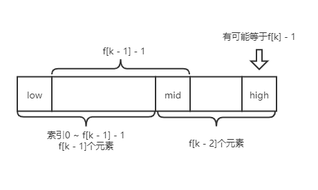

# 斐波那契数组

​	要理解斐波那契查找，首先要知道斐波那契数组。什么是斐波那契数组。怎么说，如果下次看到这个笔记不知道斐波那契数组是什么，直接百度吧。一百度就懂了，嗯，就是这样，给自己提个醒。

# 斐波那契查找

​	斐波那契查找其实也是一种二分查找，只不过斐波那契查找的mid值是通过斐波那契数组进行计算，而不是二分或者插值的计算方法。

​	mid = low + f[ k - 1] - 1;

​	其中，low是左下标，f[] 是斐波那契数组，f[k]为要查找的数组长度，那么k就是斐波那契数组的下标了。此处要理解一下f[k]。

​	斐波那契查找的核心思想就是在斐波那契数列中找一个f[k]，该值要等于或略大于要查找的数组的长度。例如，要在数组{1, 8, 10, 89, 1000, 1234}，要在这个数组中查找一个值。该数组的长度6，那么就要找斐波那契数组中值为6的k值，即为f[k] = 6。那么斐波那契数组中6的下标为几呢？

​	看一下斐波那契数组，{1, 1, 2, 3, 5, 8, ...}，这时候没有6怎么办。斐波那契查找算法给出的解决方案是，把数组扩容最接近数组长度的那个值。此例中为8，即将数组扩容到8个元素。在Java中，数组扩容后变为：{1, 8, 10, 89, 1000, 1234, 0 , 0}，算法还说了，扩容后的0值要用数组中最后一个值替换，那最终使用斐波那契搜索的数组为：{1, 8, 10, 89, 1000, 1234, 1234 , 1234}。

​	f[k]理解了，但是为什么mid = low + f[ k - 1] - 1。我们知道，斐波那契数组中，f[k] = f[k -1] + f[k - 2]。根据此规律，不难推出，我们能把长度为f[k]的数组分为长度为f[k - 1]和长度为f[k - 2]的两个数组。一般情况下，数组长度为f[k - 1]的子数组为左半部分，数组长度为f[k-2]的子数组为右半部分。（此处我一直强度f[k]为数组长度，这是理解斐波那契搜索十分重要的点，你品，你细品）。

​	以左半部分子数组为例，数组长度为f[k - 1]，而Java中数组索引以0开始，那么子数组中最后一个元素的索引是多少？肯定是f[k - 1] - 1。如果左边部分子数组索引以low开始，那么左半部分子数组中最后一个元素索引是多少？必然是low + f[k - 1] - 1。是不是很熟悉，这个值不就是mid么。

​	看了上边的解释，是不是恍然大悟。那么我们用一张图来表示一下被分隔后的数组。

​	通过上边的阅读，应该已经了解了斐波那契搜索的基本知识。搜索的基本思路就是，先用斐波那契数组算出mid索引，然后用目标值同mid索引处值进行比较，如果小于就向左搜索，如果大于，就向右搜索。（同二分查找和差值查找一致）。具体的代码不在此处粘贴，请移步至DataStructuresAlgorithms库。