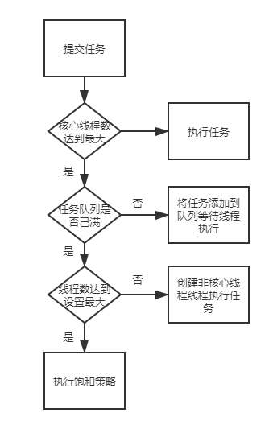
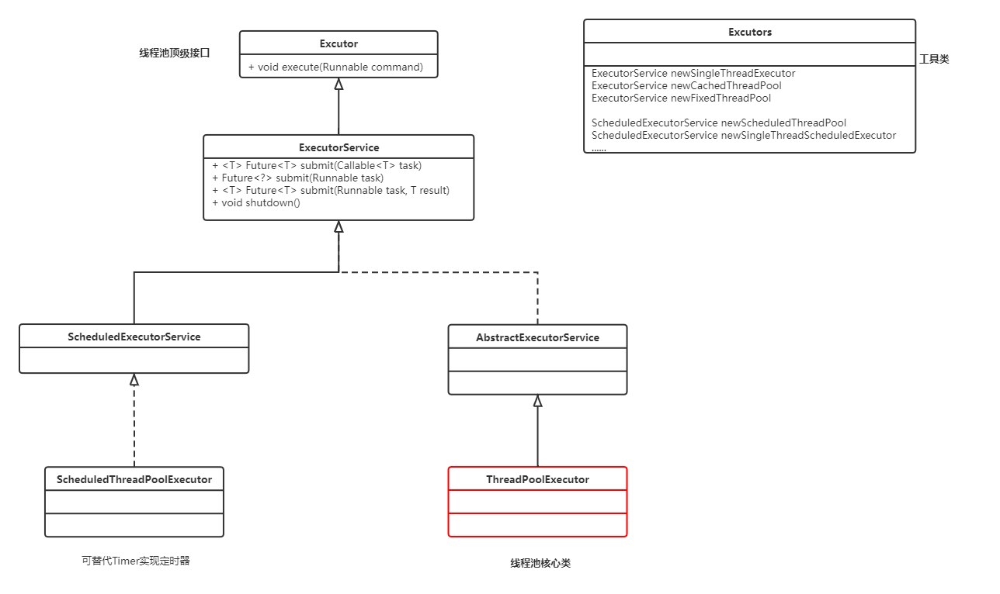

# 线程池基础

##  什么是线程池？

线程池其实就是一种多线程处理形式，处理过程中可以将任务添加到队列中，然后在创建线程后自动启动这些任务。这里的线程就是Thread，这里的任务就是实现了Runnable或Callable接口的实例对象； 

## 为什么使用线程池？

使用线程池的最大原因就是可以根据系统的需求和硬件环境灵活的控制线程的数量，且可以对所有线程进行统一的管理和控制，从而提高系统的运行效率，降低系统运行压力；

##  线程池的优点？

   1. 线程和任务分离，提升线程重用性；
   2. 控制线程并发数量，降低服务器压力，统一管理所有线程；
   3. 提升系统响应速度，假如创建线程用的时间为t1，执行任务用的时间为t2，销毁线程用的时间为t3，那么使用线程池就避免了t1和t3时间的消耗；

# Java内置线程池

## 线程池工作流程



## JDK线程池UML类图



## ExcutorService（interface）

​	ExcutorServiceJava内置线程池接口。

​	常用方法有：

```Java
void shutdow()	// 启动依次顺序关闭，执行以前提交的任务，但不接受新任务；
LIst<Runnable> shutdownNow()    // 停止所有正在执行的任务，暂停处理正在等待的任务，并返回等待执行的任务的列表；
<T> Future<T> submit(Callable<T> task)    // 执行待返回值得任务，返回一个Future对象；
Future<?> submit(Runnable task)	// 执行Runable任务，并返回一个表示该任务的Future
 <T> Future<T> submit(Runnable task, T result)	// 执行Runnable任务，并返回一个表示该任务的Future
```

## ExecutorService获取（Executors）

​	获取ExecutorService可以利用JDK中的Executors类中的静态方法，常用获取方法如下：

```java
static ExecutorService newCachedThreadPool()	// 创建一个默认的线程池对象，里边的线程可重用，且在第一次使用时才创建
static ExecutorService newCachedThreadPool(ThreadFactory threadFactory)	// 线程池中的所有线程都使用ThreadFactory来创建，这样的线程无序手动启动，自动执行；
static ExecutorService	newFixedThreadPool(int nThreads)	// 创建一个可重用固定线程数的线程池
static ExecutorService	newFixedThreadPool(int nThreads, ThreadFactory threadFactory)	// 使用ThreadFactory创建一个可重用固定线程数的线程池
static ExecutorService	newSingleThreadExecutor()	// 创建一个使用单个worker线程的Executor，以无界队列方式来运行该线程
static ExecutorService	newSingleThreadExecutor(ThreadFactory threadFactory)	// 创建一个使用单个worker线程的Executor，且线程池中的所有线程都使用ThreadFactory来创建
```

## ScheduledExecutorService（替代Timer实现定时器）

​	ScheduledExecutorService是ExecutorService的子接口，具备了延迟运行或者定期执行任务的能力。常用获取方式如下：

```Java
static ScheduledExecutorService	newScheduledThreadPool(int corePoolSize)	// 创建一个可重用固定线程数的线程池，且允许延迟运行或定期执行任务
static ScheduledExecutorService	newScheduledThreadPool(int corePoolSize, ThreadFactory threadFactory)	// 创建一个可重用固定线程数的线程池，线程池中所有的线程都使用ThreadFactory来创建，且允许延迟运行或定期执行任务
static ScheduledExecutorService	newSingleThreadScheduledExecutor()	// 创建一个单线程执行程序，它允许在给定延迟后运行命令或者定期执行
static ScheduledExecutorService	newSingleThreadScheduledExecutor(ThreadFactory threadFactory)	// 创建一个单线程执行程序，它可安排在给定延迟后运行命令或者定期执行
```

​	ScheduledExecutorSeervice常用方法

```Java
<V> ScheduledFuture<V>	schedule(Callable<V> callable, long delay, TimeUnit unit)	// 延迟单位是unit, 数量是delay的时间后执行callable
ScheduledFuture<?>	schedule(Runnable command, long delay, TimeUnit unit)	// 延迟时间单位是Unit，数量是delay的时间后执行command
ScheduledFuture<?>	scheduleAtFixedRate(Runnable command, long initialDelay, long period, TimeUnit unit)	// 延迟单位是unit，数量是initialDelay的时间后，每隔period时间重复执行一次command
ScheduledFuture<?>	scheduleWithFixedDelay(Runnable command, long initialDelay, long delay, TimeUnit unit)	// 创建并执行一个在给定初始延迟后首次启用的定期操作，随后，在每一次执行终止和下一次执行开始之间都存在给定的延迟
```

## 异步计算结果（Future）

​	有时候需要利用线程池进行一些计算，然后获取这些计算的结果。

​	Java中Futurej接口就是用来描述异步计算结果的，可以通过Future对象获取线程计算结果。Future常用方法如下：

```Java
boolean	cancel(boolean mayInterruptIfRunning)	// 试图取消对此任务的执行，true立即，false等待任务完成后取消
V get()	// 获取任务执行结果，如果必要，等到计算完成
V get(long timeout, TimeUnit unit)	// 等待给定时间后获取任务执行结果，如果等待时间到达后任务还没有执行完毕，不在等待
boolean	isCancelled()	// 如果任务正常完成前将其取消，则返回true
boolean isDone()	// 如果任务已完成，返回true
```


## JDK线程池核心类：**ThreadPoolExecutor**

​	构造方法

```java
ThreadPoolExecutor(
​	int corePoolSize,	// 核心线程数

​	int maximumPoolSize,	// 最大线程数

​	long keepAliveTime,		// 最大空闲时间，线程池中非核心线程空闲的存活时间大小

​	TimeUnit unit,			// 时间单位，线程空闲存活时间单位

​	BlockingQueue<Runnable> workQueue, // 任务队列，存放任务的阻塞队列

​	ThreadFactory threadFactory, // 线程工厂， 用于设置创建线程的工厂，可以给创建的线程设置有意义的名字，可方便排查问题。

​	RejectedExecutionHandler handler // 饱和机制处理，主要有四种类型

)
```

# 自定义线程池

## 参数设计分析

### 核心线程数（corePoolSize）

​	核心线程数的设计需要依据**任务的处理时间**和**每秒产生的任务数量**来确定。

​	例如：执行一个任务需要0.1秒，系统百分之80的时间每秒都会产生100个任务，那么想在1秒内处理完这100个任务，就需要10个线程，此时可设计**核心线程数**为10。

​	当然实际情况不可能这么平均，所以一般采用**二八原则**， 即按照百分之八十的原则设计核心线程数，剩下的百分之二十可以利用最大线程数处理。

### 任务队列数（workQueue）

​	任务队列数长度一般设计为：核心线程数 / 单个任务执行时间  * 2 即可。

​	例如上面的场景中，核心线程数设计为10个，单个任务执行时间为 0.1秒，则任务队列长度可设计为200；

### 最大线程数（maximumPoolSize）

​	最大线程的设计除了需要参照核心线程数的条件外，还需要参照系统每秒产生的最大任务数决定。

​	例如：上述环境中，如果系统每秒最大生产的任务是1000个，那么，最大线程数 = （最大任务数 - 任务队列长度）* 单个任务执行时间。即，最大线程数 = （1000 - 200）* 0.1 = 80；

### 最大空闲时间（）

​	这个参数的设计完全参考系统运行环境和硬件压力设定，没有固定的参考值。用户可以根据经验和系统产生任务的时间间隔合理设置一个值即可。

## 实现步骤

1. 编写任务类（MyTask），实现Runnable接口；
2. 编写线程类（MyWorker），继承Thread类，用于执行任务，需要持有所有任务；
3. 编写线程池类（MyThreadPool），包含提交任务，执行任务的能力；
4. 编写测试类（MyTest），创建线程池对象，提交多个任务测试；